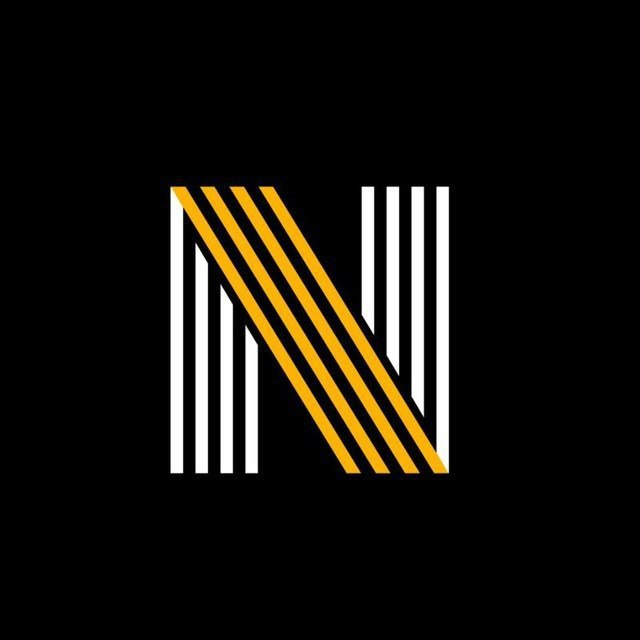

<h1 style="text-align: center; font-size: 32px; padding: 16px;">NovariaOS</h1>

<a href="#goals">Goals</a> · <a href="#features">Features</a> · <a href="#contribute">Contribute</a>

NovariaOS is a project that aims to provide a simple and easy-to-use operating system for the average user.

    
    
    
    

<h2 id="features" style="text-align: center; font-size: 32px; padding: 8px; padding-bottom: 16px;">Features</h2>

<ul style="list-style-type: none; padding: 0; text-align: center; padding-bottom: 16px;">
    <li style="margin-bottom: 10px;">
        
<strong>NVM (Novaria Virtual Machine):</strong> Safely executes bytecode within an isolated environment.

    </li>
    <li style="margin-bottom: 10px;">
        
<strong>CAPS (CAPabilities):</strong> A unique rights management system that controls and manages the permissions of any running process.

    </li>
</ul>

<h2 id="goals" style="text-align: center; font-size: 32px; padding: 16px;">Goals</h2>

By the final release, we aim to create a complete and polished system with the following ecosystem:

- A Complete Set of System Utilities (Nutils): A fully functional and coherent set of core utilities for system management that follows the internal logic of NovariaOS rather than inherited conventions.

- Programming Language Support:
    - A Low-Level Language (e.g., C): For developing system components, drivers, and high-performance applications.
    - A High-Level Scripting Language (e.g., Python): For automation, rapid development, and user convenience.

- Network Stack (Optional but Desirable): A functional network implementation sufficient for local network communication and, potentially, internet access.

- Legendary Stability and Debugging: The release version must be thoroughly debugged. We strive for a level of stability that will become a hallmark of NovariaOS, inspired by systems like FreeBSD.

- A Distinct Niche and Community: We envision NovariaOS as a respected niche OS — known in its circles, with dedicated followers who appreciate its uniqueness and use it as their primary system if it perfectly suits their needs. Like FreeBSD, NovariaOS should not be a “replacement for anything,” but should move in its own deliberately chosen direction.

<h2 id="non-goals" style="text-align: center; font-size: 32px; padding: 16px;">Non-Goals</h2>

NovariaOS is not trying to do these things:

- Replacing Mainstream OSes: NovariaOS does not aim to replace Linux, BSD, Windows, macOS, or any other widely used operating system. We are not striving for world domination.

- POSIX Compliance: We are not a POSIX-compliant operating system. While we may borrow some successful ideas, we are free to design our APIs and system behaviors as we see fit for our architecture.

- Following Trends for Trends' Sake: We will not blindly adopt every new technological fad if it does not align with the project's long-term goals and architecture.

- Complete Rejection of Heritage: We are not “mad scientists” seeking to reinvent absolutely everything. We respect OS history and will use proven concepts when they are the best solution.

<h2 id="contribute" style="text-align: center; font-size: 32px; padding: 16px;">Contribute</h2>

If you would like to contribute to NovariaOS, please feel free to open an issue or make a pull request.

Made with ❤️ by z3nnix.

